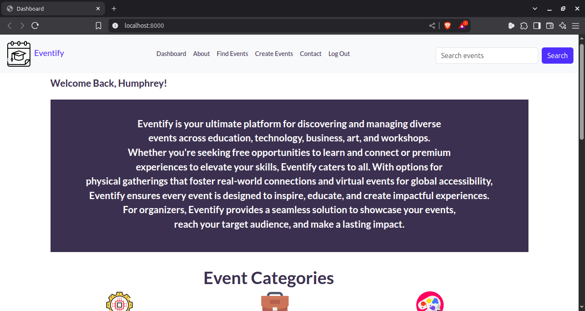
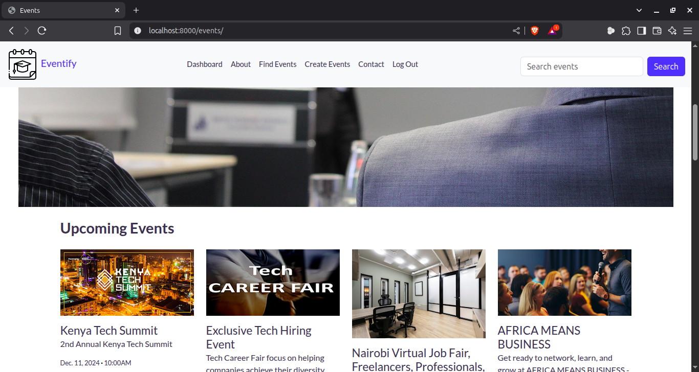

# Eventify
A Simple Events Management System built with Django

# Features
This project contains the following features: Dashboard page, About page, Find events page, 
User management section, Create events page, Search events section and Contacts page.

# Tech Stack
The following languages are used in this project: JavaScript, CSS, HTML & Python(Django)

# Project Screenshot

  

### NB: ANY CONTRIBUTIONS TO THIS PROJECT ARE WARMLY WELCOMED.

